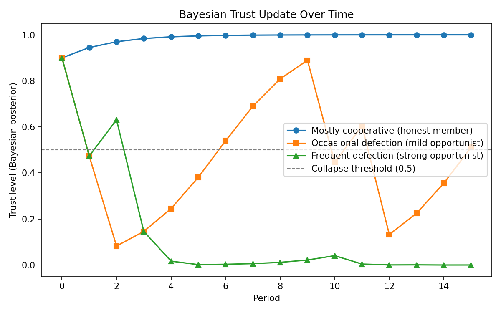
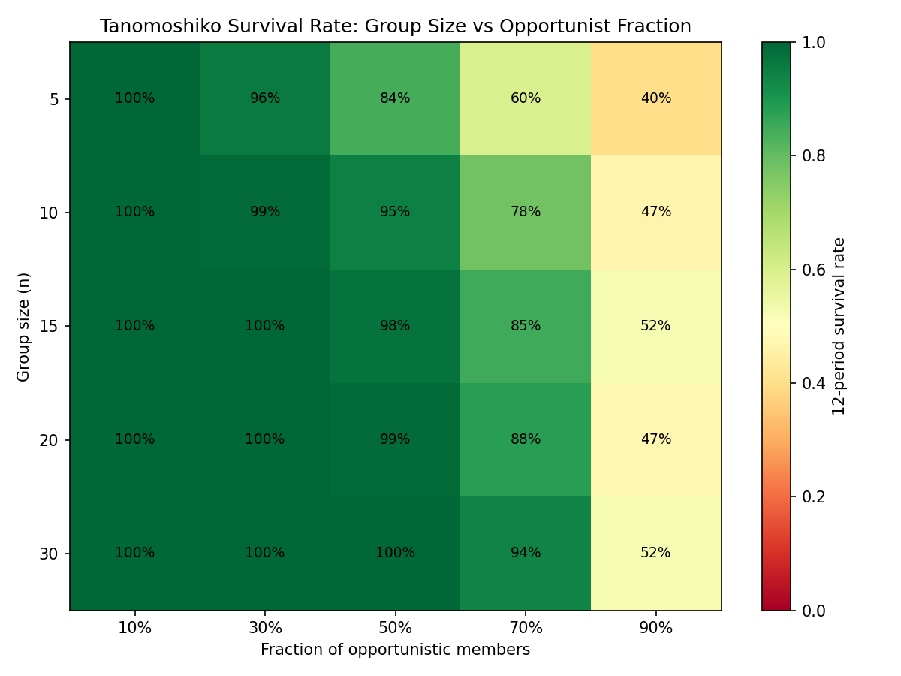

# Tanomoshiko Simulator

**A Bayesian & game-theoretic simulation of Japan's centuries-old mutual-aid finance system**

## Why I built this

Japan has run a form of peer-to-peer lending called *tanomoshiko* (also known as *mujin*) since at least the Kamakura period (13th century) — long before banks, credit scores, or collateral existed. A group of people simply pool money each period, and one member takes the full pot in turn. No credit history. No collateral. Just trust.

What's strange is that this system is still alive today, even in a country with one of the most developed banking sectors in the world. That fact alone raised a question I couldn't let go of: **what conditions make a trust-based financial system survive, and what conditions make it collapse?**

This project is my attempt to answer that question mathematically — using the same tools (Bayesian updating, game theory, Monte Carlo simulation) I've been developing in my ongoing research on financial inclusion and credit design.

## What's inside

### 1. Replicating the theoretical baseline

Sakakibara (2014), *"The Economic Meaning of Mujin"* (無尽講の経済的意味), builds a 3-person, 3-period model comparing three institutions: a complete market, a competitive loan market, and a mujin (tanomoshiko). His key finding is that mujin allocations are *ex ante* Pareto optimal, but once a shock is realized, a majority of members would prefer to abandon the mujin in favor of the loan market — a form of **time inconsistency**.

[`01_sakakibara_replication.py`](01_sakakibara_replication.py) reproduces his exact numerical example (β = 0.9, log utility) and validates against his published values:

| Quantity | Paper value | My replication |
|---|---|---|
| Expected utility, mujin allocation | 1.88 | 1.8784 |
| Expected utility, loan market (overall) | 1.74 | 1.7408 |
| Shocked member's utility (loan market) | 0.967 | 0.9672 |
| Unshocked members' utility (loan market) | 2.1275 | 2.1275 |

This confirms the theoretical mechanism before I extend it.

### 2. Generalizing to n members with Bayesian trust

Sakakibara's model is fixed at 3 people. Real tanomoshiko groups range from a handful of relatives to dozens of members (Shimizu, 1972, documents groups from 7 to 200+ members). [`02_bayesian_trust_and_stability.py`](02_bayesian_trust_and_stability.py) generalizes the setup:

- Each member has a hidden type — honest or opportunistic — that isn't directly observable.
- Every period, other members update their belief about a member's type using **Bayes' rule**, conditioning on whether that member contributed or defected.
- A member's decision to stay in or leave the group is modeled as a **participation constraint**: they stay only if the expected value of continued cooperation exceeds the value of exiting to the loan market — a generalization of the time-inconsistency logic in Sakakibara's paper.
- A **Monte Carlo simulation** runs thousands of randomized groups to estimate the probability that a group survives a given number of periods, as a function of group size and the fraction of opportunistic members.

### 3. Results

**Trust evolves very differently depending on member type:**



Honest members' trust converges toward 1.0 quickly. Frequent defectors are pushed toward 0 and stay there. Occasional defectors oscillate — this middle case is where a group's fate is genuinely uncertain.

**Larger groups are more resilient to individual defection:**



This was the most interesting finding for me, and it isn't something Sakakibara's 3-person model can show. Averaging trust across more members dilutes the effect of any single defection — a small tanomoshiko can collapse quickly even with a moderate fraction of opportunists, while a large one stays stable well past that point. This offers a possible explanation for why real tanomoshiko groups historically ranged so widely in size, and why larger community-based groups (documented in Shimizu, 1972) were able to persist for decades.

## What's mine vs. what's from prior work

- The **theoretical framework** (mujin vs. loan market, time inconsistency, log utility setup) closely follows Sakakibara (2014). My contribution here is the faithful numerical replication as a validation step.
- The **Bayesian trust-updating mechanism, the n-person generalization, the participation-constraint stability condition, and the Monte Carlo survival analysis** are my own extensions, built independently for this project.
- The historical context draws on Shimizu (1972), a field survey of ~100 households using tanomoshiko in Osaka, Nara, and Hyogo prefectures.

## References

- Sakakibara, K. (2014). 無尽講の経済的意味 [The Economic Meaning of Mujin]. *Chiba University Economic Research*, 29(3), 133–146.
- Shimizu, K. (1972). The 'Tanomoshi': Its Historic Processes and Present Situations. *Nara University of Education*, 21(1), 177–191.
- Besley, T., Coate, S., & Loury, G. (1993). The Economics of Rotating Savings and Credit Associations. *American Economic Review*, 83, 792–810.

## Running the code

```bash
git clone https://github.com/koyamashuta1216-cyber/tanomoshiko-simulator.git
cd tanomoshiko-simulator
pip install numpy matplotlib

python 01_sakakibara_replication.py
python 02_bayesian_trust_and_stability.py
python 03_visualizations.py
```

## What's next

I'm working on turning this into an interactive web app (Streamlit) so anyone can adjust group size, defection rates, and see the survival simulation update live. Follow progress on [econedu-hs](https://econedu-hs.beehiiv.com).
